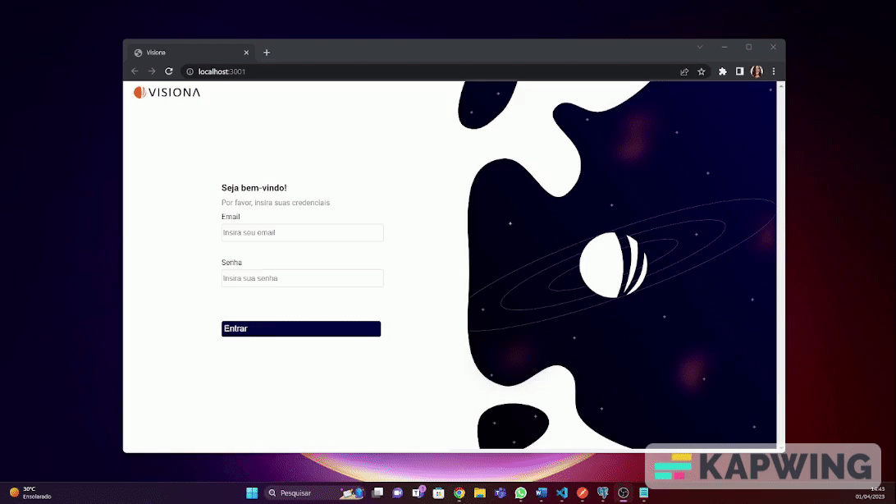
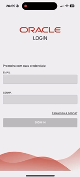
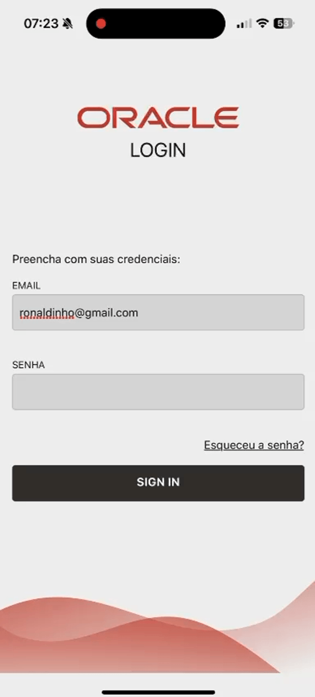
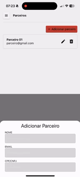
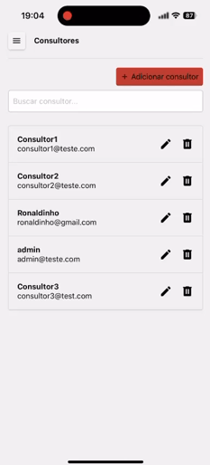
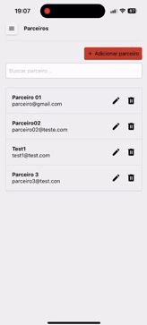

# Yago Pereira Silva

## Introdução

Iniciei minha jornada acadêmica com uma formação em Ciências Militares pela Academia Militar das Agulhas Negras. Contudo, minha curiosidade e interesse por tecnologia me levaram a uma transição de carreira para a área de Tecnologia da Informação, iniciando o curso de Análise de Desenvolvimento de Sistemas na FATEC de São José dos Campos.

Busco desafios como desenvolvedor, onde minha versatilidade em linguagens de programação e minha paixão pelo aprendizado constante possam ser aproveitadas. Comprometido em compartilhar meu conhecimento, busco contribuir ativamente para o crescimento da equipe, enquanto almejo atingir minhas metas de evolução profissional e fazer parte de um ambiente que valoriza a inovação e a excelência técnica.

## Contatos
* [GIT](https://github.com/YagoPSilva)
* [LinkedIn](https://www.linkedin.com/in/yago-pereira21/)

## Meus Principais Conhecimentos
* Programação em Python e C#
* Integração de APIs (REST e SOAP)
* Gestão de Filas com RabbitMQ
* Criação de Dashboards Web
* Automatização de Processos
* Ferramentas GIS (Esri ArcGIS)
* Gerenciamento de Bancos de Dados Relacionais (Oracle, PostgreSQL, SQL Server)

## Meus Projetos

### Em 2022-1

No primeiro semestre de 2022, em colaboração com a FATEC, desenvolvemos um sistema web destinado à automação do processo de catalogação de vagas de emprego em diversas áreas profissionais, com foco especial em Tecnologia da Informação (TI). Além disso, nosso objetivo era configurar métricas que avaliassem diferentes tipos de conhecimento, habilidades e competências necessárias para essas vagas. Durante esse projeto, um grande ponto de aprendizado foi a necessidade de realizar uma raspagem web para buscar vagas de emprego em uma plataforma já existente. Em termos visuais, buscamos criar uma interface que fornecesse informações estratégicas por meio de gráficos, priorizando a facilidade de uso e operação. Todo o processo de desenvolvimento foi documentado de forma abrangente no GitHub, contemplando os procedimentos essenciais para garantir a satisfação do cliente.

 
  

    

 
  

    

 
  

    

Para mais informações:
[GIT](https://github.com/Fiv5TechCo/API-1ADS-2022-1)

#### Tecnologias Utilizadas
* HTML5 (Front-end) 
* CSS3 (Front-end)
* Java Script (Front-end)
* Bootstrap (Front-end)
* Python (Back-end)
* Flask (Back-end)
* SQLite (Banco de Dados)
* Github (Documentação e Versionamento)
* Figma (Prototipagem)

#### Contribuições Pessoais
Durante minha participação no projeto, desempenhei um papel essencial tanto no desenvolvimento técnico quanto na gestão eficaz da equipe. Como Scrum Master, fui encarregado de liderar e coordenar as atividades do time, garantindo a adesão aos princípios ágeis e promovendo um ambiente de trabalho colaborativo e produtivo.

Minhas responsabilidades incluíam o gerenciamento das tarefas da equipe, desde o planejamento até a entrega, utilizando metodologias ágeis para garantir o cumprimento dos prazos e a qualidade do trabalho. Além disso, fui responsável por facilitar as reuniões diárias, as sessões de planejamento de sprint e as retrospectivas, promovendo a comunicação eficaz e a resolução de impedimentos.

Além do meu papel como Scrum Master, também contribuí ativamente para o desenvolvimento técnico do projeto. Fui responsável pela implementação das rotas e pela configuração inicial da aplicação com Flask, além de criar a conexão com o banco de dados SQLite e a realização da raspagem de dados por meio da biblioteca Beautiful Soup.

Na parte de interface do usuário, atuei a criação de templates HTML dinâmicos e a estilização com Bootstrap, garantindo uma experiência de usuário atraente e intuitiva. Também implementei situações lógicas em HTML usando o Jinja, como a paginação, para melhorar a usabilidade da plataforma.

Adicionalmente, desempenhei um papel-chave na geração de gráficos de burndown, fornecendo uma visão clara do progresso do projeto ao longo do tempo e auxiliando na identificação de possíveis desafios e áreas de melhoria.

Minha abordagem, combinada com minhas habilidades técnicas e de liderança, foram fundamentais para o sucesso deste projeto. Estou extremamente orgulhoso de ter contribuído de maneira significativa tanto para o desenvolvimento técnico quanto para a gestão eficaz da equipe.

#### Hard Skills
* HTML5 - Capacidade de criar estruturas semânticas em páginas web, proporcionando uma organização clara e eficiente do conteúdo. (Tenho autonomia)
* CSS3 - Habilidade para estilizar páginas web de forma autônoma, garantindo uma apresentação visual atrativa e coerente com os padrões modernos de design, utilizando frameworks como Bootstrap para agilizar o desenvolvimento. (Tenho autonomia)
* JavaScript - Competência em manipular o DOM e desenvolver lógica de programação, enriquecendo a interatividade e funcionalidade das aplicações web, e também utilizando frameworks como jQuery para simplificar o desenvolvimento. (Tenho autonomia)
* Python - Habilidade em desenvolver lógica de programação de maneira independente, utilizando Python como linguagem principal e também frameworks como Flask para desenvolvimento web. (Tenho autonomia)
* SQL - Capacidade de realizar operações CRUD de forma autônoma em bancos de dados SQLite, garantindo a eficiência e integridade na manipulação de dados. (Tenho autonomia)
* Scrum Master - Experiência em liderar equipes e coordenar atividades de acordo com metodologias ágeis, garantindo o cumprimento de prazos e a qualidade do trabalho. (Tenho autonomia)
* Gráficos de Burndown - Capacidade de criar e interpretar gráficos de burndown, fornecendo insights valiosos sobre o progresso do projeto ao longo do tempo e auxiliando na tomada de decisões estratégicas. (Tenho autonomia)

#### Soft Skills
* Colaboração - Demonstrei habilidades de colaboração ao trabalhar em equipe, compartilhando conhecimento, ajudando colegas com dificuldades e contribuindo para um ambiente de trabalho positivo e produtivo.
* Adaptabilidade - Mostrei capacidade de me adaptar a diferentes situações e exigências do projeto, ajustando-me às mudanças de prioridades, prazos e requisitos conforme necessário para alcançar os objetivos.
* Pensamento Crítico - Utilizei habilidades de pensamento crítico para analisar problemas complexos, identificar soluções eficazes e tomar decisões embasadas, contribuindo para o sucesso do projeto.
* Resolução de Problemas: Demonstrei habilidades sólidas em resolução de problemas ao enfrentar desafios técnicos e encontrar soluções eficientes e inovadoras, contribuindo para o avanço e aprimoramento do projeto.
* Gestão do Tempo - Gerenciei eficientemente meu tempo e minhas tarefas, priorizando atividades, cumprindo prazos e mantendo o projeto dentro do cronograma estabelecido.
* Proatividade - Tomei iniciativas e busquei constantemente maneiras de melhorar o projeto, identificando oportunidades de otimização, antecipando possíveis problemas e tomando medidas preventivas.
* Adaptabilidade - Demonstrei flexibilidade e adaptabilidade ao lidar com mudanças de escopo, requisitos ou tecnologias, ajustando-me rapidamente às novas circunstâncias e garantindo a continuidade do progresso do projeto.

### Em 2022-2

No segundo semestre de 2022, em parceria com a TrackCash, propomos o desenvolvimento de um Software Desktop com o objetivo de otimizar o processo de reconciliação financeira. O projeto visa criar uma plataforma que autorize o acesso automatizado às informações de vendas dos clientes da TrackCash por meio de API's e planilhas, simplificando a conciliação financeira. Nosso foco será garantir uma interface intuitiva e segura, priorizando a proteção dos dados dos clientes. Todo o processo será documentado e implementado seguindo as melhores práticas de gestão de projetos, com o compromisso de atender às necessidades específicas da TrackCash.

 
  

    

 
  

    

 
  

    

Para mais informações:
[GIT](https://github.com/micael-leal/API-FATEC-2-SEM)

#### Tecnologias Utilizadas
* Java (Back-end e Front-end com JavaFX)
* MySQL (Banco de Dados)
* Figma (Prototipagem)
* Git (Versionamento)
* Github (Documentação e Versionamento)
* Scene Builder (Front-end)

#### Contribuições Pessoais
Durante o projeto em parceria com a TrackCash participei de várias etapas fundamentais do desenvolvimento do Software Desktop voltado para otimização do processo de reconciliação financeira. Em primeiro lugar, contribuí significativamente com a configuração do banco de dados, criando um script SQL detalhado que contemplava a criação das tabelas necessárias e auxiliando na modelagem dos dados, garantindo uma estrutura sólida e eficiente para armazenar as informações financeiras dos clientes da TrackCash.

Além disso, fui responsável pela implementação da lógica de recuperação de e-mail, um aspecto crucial para a segurança e a conveniência dos usuários do sistema. Utilizei o protocolo SMTP e o pacote Java Mail para desenvolver um mecanismo robusto que permitisse o envio seguro de tokens de recuperação de senha para os clientes da TrackCash, proporcionando uma experiência de usuário tranquila e confiável.

Outra contribuição significativa foi a criação da interface gráfica do sistema utilizando JavaFX, com o apoio do Scene Builder. Esta etapa envolveu a concepção e implementação de telas intuitivas e visualmente atraentes, garantindo uma experiência de usuário agradável e eficiente. Além disso, trabalhei na implementação das funcionalidades de login como administrador, garantindo que apenas usuários autorizados tivessem acesso privilegiado ao sistema, e desenvolvi interfaces adicionais para as operações específicas de administrador, garantindo uma usabilidade fluida e consistente em todo o sistema.

#### Hard Skills
* SQL - Habilidade em criar scripts SQL para configuração de bancos de dados e modelagem de dados, assegurando uma estrutura sólida e eficiente para armazenamento de informações financeiras. (Tenho autonomia)
* Protocolo SMTP e Java Mail - Competência em utilizar protocolos de comunicação e pacotes específicos como Java Mail para implementar a funcionalidade de recuperação de e-mail, garantindo a segurança e confiabilidade no envio de tokens de recuperação de senha. (Tenho autonomia)
* JavaFX e Scene Builder - Capacidade de desenvolver interfaces gráficas utilizando JavaFX e Scene Builder, proporcionando uma experiência de usuário intuitiva e atraente, e facilitando a interação com o sistema. (Tenho autonomia parcial)
* Administração de Privilégios de Usuário - Habilidade em implementar funcionalidades de login como administrador e definir privilégios de usuário, assegurando que apenas usuários autorizados tenham acesso privilegiado ao sistema. (Tenho autonomia)
* Desenvolvimento Independente - Competência em trabalhar de forma autônoma na implementação de funcionalidades específicas do projeto, demonstrando capacidade de resolver problemas e alcançar objetivos sem supervisão direta. (Tenho autonomia)

#### Soft Skills
* Comunicação Efetiva - Demonstrei habilidade em comunicar de forma clara e eficiente os requisitos do banco de dados aos membros da equipe, garantindo uma compreensão mútua e uma implementação precisa da estrutura de dados necessária para o projeto.
* Colaboração Proativa - Contribuí ativamente para as reuniões de equipe, oferecendo insights e sugestões para melhorar a lógica de recuperação de e-mail e a interface gráfica, promovendo um ambiente de colaboração e inovação.
* Resolução de Problemas - Enfrentei desafios na implementação da lógica de recuperação de e-mail, identificando e corrigindo erros no código Java Mail, garantindo que o processo de envio de tokens de recuperação de senha fosse confiável e eficaz.
* Adaptabilidade - Adaptei-me às mudanças nos requisitos do projeto, ajustando a interface gráfica com base no feedback do cliente e integrando novas funcionalidades, como a administração de privilégios de usuário, de forma oportuna e eficiente.

### Em 2023-1

No primeiro semestre de 2023, em colaboração com a Visiona, nosso objetivo foi desenvolver um aplicativo web escalável baseado em microsserviços, adotando os princípios SOLID. O projeto abrangeu todas as etapas, desde documentação até implementação e distribuição, com uso de Git, code review e CI/CD. Optamos por um banco de dados relacional para garantir a transformação eficiente de dados em informações. A proposta central envolveu a criação de um sistema de gerenciamento de usuários completo, incluindo funcionalidades como criação, visualização, edição e remoção, junto a um serviço de autenticação/autorização robusto. Este projeto representou uma oportunidade para aplicar teoria na prática, resultando em uma solução de software de alta qualidade e desempenho.

 
  

    

Para mais informações:
[GIT](https://github.com/CamilaRedondo/API-FATEC-3-SEM/tree/Development)

#### Tecnologias Utilizadas
* React (Front-end)
* NodeJS (Back-end)
* Postgres (Banco de Dados)
* Git (Versionamento)
* Github (Documentação e Versionamento)
* Figma (Prototipagem)

#### Contribuições Pessoais
Durante o primeiro semestre de 2023 desempenhei um papel importante em várias etapas do desenvolvimento da aplicação web. Em primeiro lugar, concentrei-me na criação da página de login e na implementação de componentes reutilizáveis com React no frontend. Esta tarefa foi fundamental para garantir uma interface de usuário dinâmica e responsiva, facilitando a interação dos usuários com a aplicação.

Além disso, assumi a responsabilidade pela segurança do sistema, especialmente no que diz respeito à encriptação de senhas utilizando a biblioteca Bcrypt. Esta medida foi essencial para proteger os dados sensíveis dos usuários contra possíveis ataques cibernéticos.

Outra área na qual contribuí significativamente foi na verificação da navegação na aplicação, assegurando redirecionamentos eficientes entre as diferentes páginas. Isso proporcionou uma experiência de usuário mais suave e intuitiva.

Trabalhei na implementação do sistema de recuperação de senhas por e-mail, com foco especial nas rotas de atualização de senha no backend. Isso exigiu a integração de diferentes componentes do sistema, desde a geração de tokens até a interação com serviços de e-mail, para garantir uma experiência de usuário contínua e segura.

Por fim, contribuí para a criação de uma página de not found personalizada, incluindo o design, para melhorar a experiência do usuário em situações de erro. Esta etapa foi importante para garantir uma experiência consistente e agradável para os usuários, mesmo em casos de páginas não encontradas.

#### Hard Skills
* React - Competência em desenvolver interfaces de usuário dinâmicas e responsivas utilizando o framework React, garantindo uma experiência de usuário fluída e interativa. (Tenho autonomia)
* Node.js - Habilidade em desenvolver o backend da aplicação utilizando Node.js, permitindo a construção de servidores web eficientes e escaláveis. (Tenho autonomia)
* Encriptação de Senhas com Bcrypt - Capacidade de implementar segurança de dados eficaz, protegendo as senhas dos usuários por meio da encriptação utilizando a biblioteca Bcrypt. (Tenho autonomia)
* Integração de Serviços de E-mail - Competência em integrar serviços de e-mail à aplicação, possibilitando o envio de e-mails automatizados para recuperação de senhas e outras funcionalidades. (Tenho autonomia)
* Verificação de Navegação na Aplicação - Habilidade em garantir uma navegação suave e intuitiva na aplicação, assegurando redirecionamentos eficientes entre as diferentes páginas. (Tenho autonomia)
* Criação de Interfaces Gráficas com Design - Capacidade de criar interfaces gráficas visualmente atrativas e funcionais, contribuindo para uma experiência de usuário agradável e eficiente. (Tenho autonomia)
* Desenvolvimento de Requisições HTTP com Fetch - Competência em realizar requisições HTTP utilizando o método Fetch do React, permitindo a comunicação entre o frontend e o backend de forma eficiente e assíncrona. (Tenho autonomia)
* Manipulação de Dados em Bancos de Dados Relacionais - Habilidade em realizar operações CRUD (Create, Read, Update, Delete) em bancos de dados relacionais, garantindo a eficiência na manipulação de dados da aplicação. (Tenho autonomia)

#### Soft Skills
* Comunicação Efetiva - Capacidade de comunicar de forma clara e eficiente com os membros da equipe e stakeholders, explicando detalhadamente a implementação da página de login e dos componentes reutilizáveis com React, garantindo uma compreensão mútua e alinhada dos requisitos e funcionalidades.
* Trabalho em Equipe Colaborativo - Habilidade em colaborar de forma eficaz com colegas de equipe na resolução de problemas específicos, como a integração do sistema de recuperação de senha por e-mail, discutindo soluções e compartilhando conhecimento para implementar uma funcionalidade robusta e eficiente.
* Foco em Resultados - Orientação para resultados, mantendo-se focado em alcançar objetivos específicos do projeto, como a criação do sistema de gerenciamento de usuários com funcionalidades de criação, visualização, edição e remoção, garantindo a entrega de uma solução completa e funcional.
* Resiliência - Capacidade de lidar com desafios e contratempos, como a resolução de problemas durante a implementação da lógica de recuperação de senha por e-mail, mantendo-se motivado e perseverante para encontrar soluções eficazes e garantir o progresso contínuo do projeto.
* Pensamento Crítico - Competência em analisar e avaliar diferentes abordagens para resolver problemas técnicos, como a seleção da melhor estratégia para a integração de serviços de e-mail no sistema de recuperação de senha, considerando critérios técnicos e requisitos específicos do projeto para tomar decisões informadas.

### Em 2023-2

No segundo semestre de 2023, em parceria com a Greenneat, desenvolvemos uma plataforma inovadora com o objetivo de gerenciar créditos utilizados como contrapartida na coleta de materiais pelos parceiros nos estabelecimentos cadastrados. Esta solução permitiu aos parceiros comparar e revender óleo para a Greenneat, utilizando os créditos obtidos para adquirir saneantes na loja virtual da empresa. Além disso, a plataforma ofereceu acesso a um histórico detalhado de transações para parceiros e estabelecimentos, enquanto o administrador teve controle total sobre os registros e acesso a um dashboard com informações estratégicas sobre a economia circular.

 
  

    

 
  

    

Para mais informações:
[GIT](https://github.com/JoaoHenrique7/API-FATEC-4-SEM)

#### Tecnologias Utilizadas
* React (Front-end)
* NodeJS (Back-end)
* Git (Versionamento)
* Figma (Prototipagem)
* Github (Documentação e Versionamento)
* SQLite (Banco de Dados)

#### Contribuições Pessoais
Durante o projeto, desempenhei um papel fundamental em várias áreas-chave. Em primeiro lugar, liderei a criação de um sistema abrangente de listagem de usuários, tanto no frontend, desenvolvendo uma tabela componentizada utilizando React, quanto no backend, onde fui responsável pela implementação das rotas correspondentes. Esta funcionalidade foi crucial para garantir uma interface intuitiva e eficiente para os usuários.

Além disso, concentrei meus esforços na funcionalidade principal do sistema, que envolvia transações de óleo entre os usuários. Desenvolvi os formulários no frontend e implementei toda a lógica no backend, assegurando o correto armazenamento das informações no banco de dados. Isso incluiu não apenas a lógica de negócios para processar as transações, mas também a criação de algoritmos para converter valores e garantir a precisão dos cálculos.

Um aspecto adicional do meu trabalho foi a implementação de um serviço para permitir que os usuários atualizassem a quantidade de óleo disponível para transações. Este serviço foi projetado para ser simples e intuitivo, oferecendo aos usuários uma maneira fácil de manter seus estoques atualizados e prontos para transações futuras.

#### Hard Skills
* React - Competência em desenvolver componentes reutilizáveis e construir interfaces de usuário dinâmicas, proporcionando uma experiência interativa e responsiva para os usuários. (Tenho autonomia)
* Node.js - Habilidade para criar e gerenciar o backend da aplicação, desenvolvendo rotas, controladores e serviços para processar as requisições dos clientes de forma eficiente. (Tenho autonomia)
* Utilização de Banco de Dados SQLite - Habilidade em usar o SQLite para armazenar e gerenciar dados relevantes para a aplicação, como registros de transações e controle de estoque disponível. (Tenho autonomia)
* Lógica de Programação - Competência em desenvolver algoritmos e estruturas de dados eficientes, exemplificada na implementação da lógica de transações de óleo entre os usuários, garantindo o correto processamento e registro das transações. (Tenho autonomia)
* Análise de Requisitos e Regras de Negócio - Habilidade em compreender e interpretar requisitos do cliente e regras de negócio, demonstrada na análise e implementação das funcionalidades principais do sistema, como o processo de transação de óleo e controle de estoque disponível. (Tenho autonomia)

#### Soft Skills
* Colaboração Efetiva - Demonstração de habilidade em integrar a lógica de transações de óleo com outros aspectos do sistema, como a interface de usuário e o controle de estoque, em cooperação com outros membros da equipe de desenvolvimento.
* Comunicação Clara e Eficiente - Habilidade em explicar detalhadamente a implementação da lógica de transações de óleo para outros membros da equipe, garantindo uma compreensão clara do funcionamento do sistema e facilitando a colaboração no projeto.
* Resolução de Problemas em Equipe - Capacidade de identificar e resolver problemas relacionados à lógica de transações de óleo em conjunto com outros desenvolvedores, implementando soluções criativas e eficazes para garantir o funcionamento adequado do sistema.
* Adaptabilidade - Flexibilidade para ajustar a lógica de transações de óleo conforme necessário, em resposta a mudanças nos requisitos do projeto ou nos feedbacks dos usuários, garantindo que o sistema permaneça eficiente e atualizado.
* Foco em Resultados - Orientação para alcançar os objetivos específicos relacionados à lógica de transações de óleo, priorizando tarefas e recursos para garantir que o componente essencial do sistema seja entregue dentro dos prazos estabelecidos.
* Atitude Proativa - Iniciativa em antecipar possíveis problemas na lógica de transações de óleo e tomar medidas preventivas para evitá-los, garantindo a estabilidade e o desempenho do sistema durante todo o desenvolvimento.

### Em 2024-1

No primeiro semestre de 2024, em colaboração com a Oracle, desenvolvemos um sistema de gestão de parceiros em plataforma mobile para centralizar e automatizar atividades relacionadas à gestão de parceiros de negócios. O sistema permite cadastrar, editar, excluir e monitorar dados dos parceiros, acompanhando o desenvolvimento de conhecimento para remuneração e extraindo relatórios de desempenho. Priorizamos uma interface intuitiva e eficiente, incluindo funcionalidades de administração com cadastro e edição de administradores, além de um sistema de login com diferentes níveis de acesso. Todo o desenvolvimento foi documentado no GitHub, garantindo transparência e manutenção futura.

 
  

    

 
  

    

 
  

    

 
  

    

 
  

    

 
  

    

 
  

    

 
  

    

Para mais informações:
[GIT](https://github.com/henriqFerreira/API-FATEC-5-SEM)

#### Tecnologias Utilizadas
* React Native (Front-end)
* NodeJS (Back-end)
* Git (Versionamento)
* Figma (Prototipagem)
* Github (Documentação e Versionamento)
* MongoDB (Banco de Dados)

#### Contribuições Pessoais
Como Product Owner, atuei diretamente junto ao cliente, definindo requisitos essenciais, histórias de usuário detalhadas e critérios de aceitação claros. Esta interação constante garantiu que as necessidades do cliente fossem plenamente compreendidas e traduzidas de forma eficaz nas funcionalidades do sistema. Além disso, fui responsável pela confecção e manutenção dos backlogs do produto e de cada sprint, priorizando tarefas de acordo com o valor de negócio e a urgência, assegurando uma entrega contínua de valor.

No front-end, desenvolvi funcionalidades para a usabilidade do sistema, incluindo a criação de filtros dinâmicos de pesquisa com base em nome e email, que facilitam a localização rápida de informações. Também desenvolvi componentes para a máscara de senhas, aumentando a segurança das entradas de dados e aprimorando a experiência do usuário.

Além disso, fui responsável pela modelagem das collections no MongoDB. Esta tarefa envolveu definir a estrutura de dados de forma eficiente e alinhada aos requisitos do sistema, garantindo que o armazenamento e a recuperação das informações fossem rápidos e precisos, suportando todas as funcionalidades planejadas para o sistema.

#### Hard Skills
* Product Owner - Experiência em trabalhar diretamente com o cliente para definir requisitos, histórias de usuário e critérios de aceitação, assegurando uma compreensão clara das necessidades do negócio e uma entrega eficaz de funcionalidades. (Tenho autonomia)
* Backlog Management - Habilidade em criar e manter backlogs de produto e sprint, priorizando tarefas com base no valor de negócio e urgência, garantindo uma entrega contínua e alinhada às expectativas do cliente. (Tenho autonomia)
* React Native - Competência em desenvolver aplicações móveis nativas utilizando React Native, criando interfaces de usuário dinâmicas e responsivas que melhoram a experiência do usuário. (Tenho autonomia parcial)
* TypeScript - Habilidade em utilizar TypeScript para desenvolver código seguro e escalável, garantindo maior robustez e facilidade de manutenção no desenvolvimento. (Tenho autonomia)
* MongoDB - Competência em modelar collections e estruturar dados de forma eficiente, assegurando uma manipulação e recuperação de dados rápida e precisa. (Tenho autonomia)

#### Soft Skills
* Comunicação Efetiva - Transmissão clara dos requisitos do cliente para a equipe de desenvolvimento, garantindo uma compreensão precisa das necessidades do projeto.
* Colaboração - Trabalho de forma colaborativa com a equipe de desenvolvimento na implementação de funcionalidades, compartilhando ideias e soluções para alcançar os objetivos do projeto.
* Adaptabilidade - Adaptação rápida a mudanças nos requisitos do projeto, ajustando prioridades e tarefas para garantir uma resposta eficaz às novas demandas.
* Gestão do Tempo - Gerenciamento eficaz do tempo, priorizando tarefas e cumprindo prazos estabelecidos, garantindo uma entrega pontual das funcionalidades.
* Pensamento Crítico - Análise crítica dos requisitos do projeto, avaliando as possíveis implicações e tomando decisões fundamentadas para alcançar os objetivos estabelecidos.
* Resiliência - Atuação positiva com contratempos durante o desenvolvimento, mantendo o foco nos objetivos do projeto e buscando soluções alternativas para superar desafios.

### Em 2024-2
Mesmo formato
